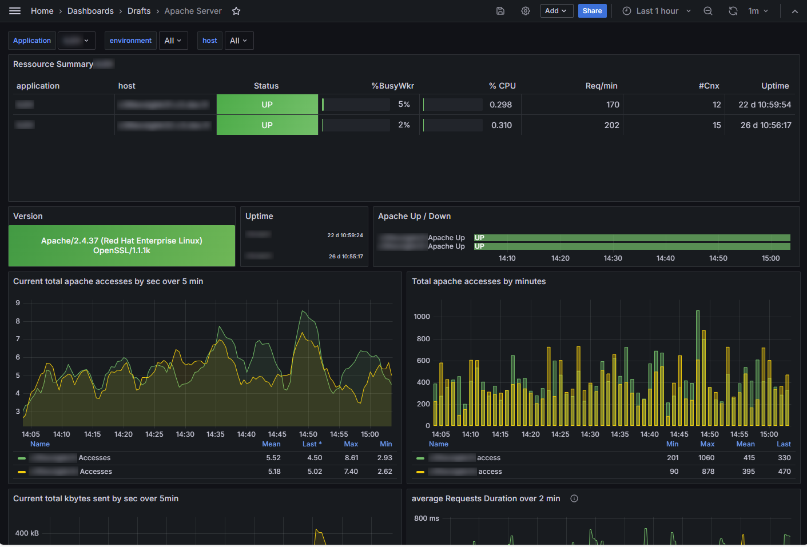

# apache_exporter

## Overview

<!-- see [more screenshots](./screenshots/details.md) -->

## Description

This contribution to httpapi_exporter is an adaptation of the formulae from the "standard" [apache_exporter](https://github.com/Lusitaniae/apache_exporter). Metrics have same names so that standard dashboards can be used.

So why not use standard apache_porter ? Well if you encounter problems with some metrics (parse failures by example) or want to valorize others metrics, you can add or alter the metrics scripts! (see [apache_status.collector.yml](./etc/apache/metrics/apache_status.collector.yml))
