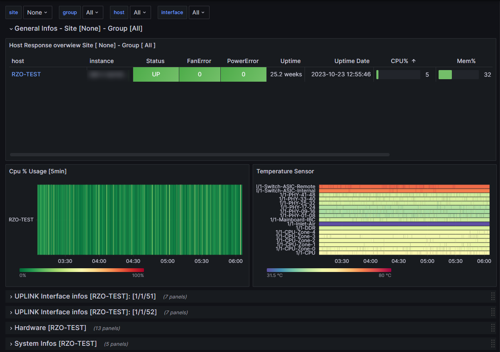
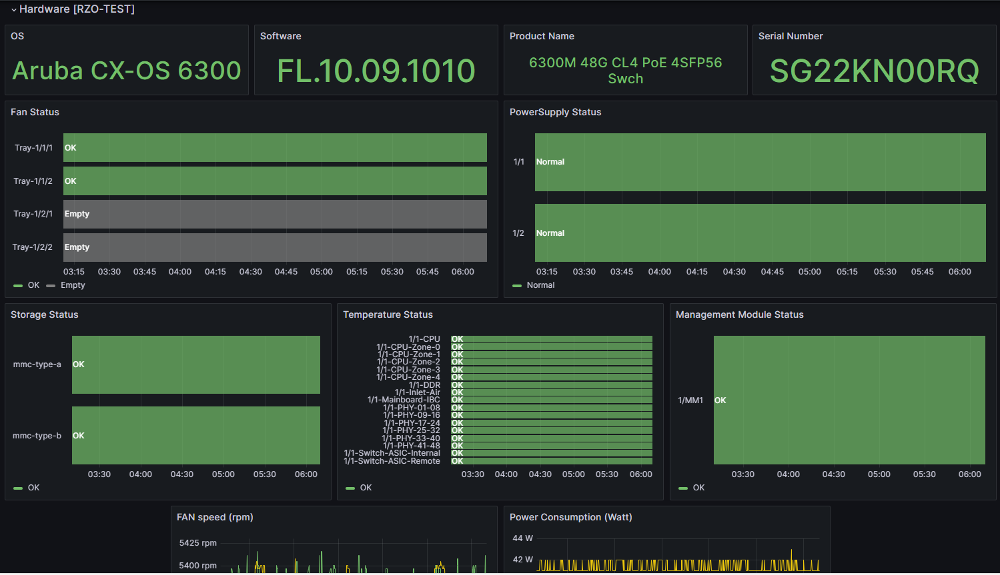
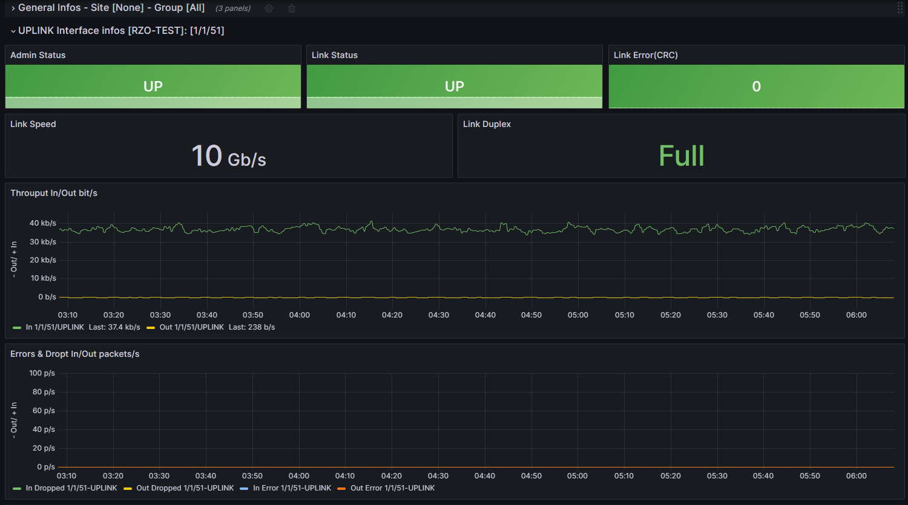
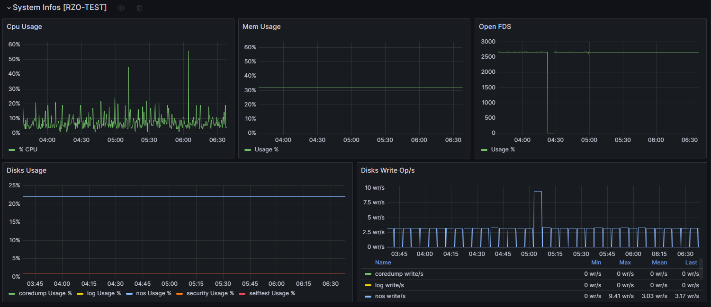

# Dashboard Screenshots

## Overview

## Details hardware components

Fans, PowerSuplies, Thermal Sensor, Storage, Management Module

## Specific links informations

collect upon interface description: UPLINK

# System Informations

CPU, Mem, Partitions Usage

