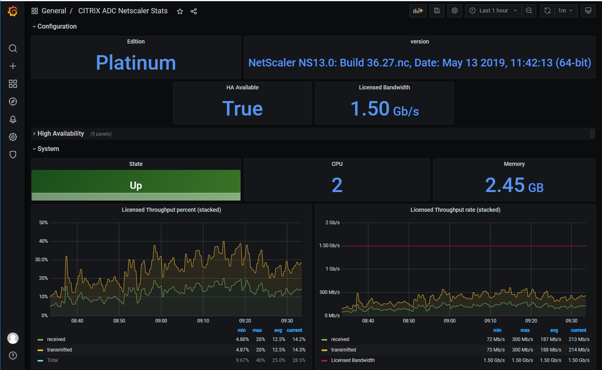

# netscaler_exporter

## Overview



## Description
Prometheus exporter for Netscaler (CITRIX ADC)

This exporter collect metrics from netscaler HTTP REST API.

It uses httpapi_exporter that exposes metrics to http (default port 9259) that can be then scrapped by Prometheus.

This exporter is strongly inspired from [citrix-adc-metrics-exporter](citrix/citrix-adc-metrics-exporter/)

It allows you collect several netscalers by adding them to the YAML config files and then specifying a target parameter in Prometheus configuration. It benefits all features from httpapi_exporter : targets, models, auth and proxies.

**Config**: [see etc/config.yml](etc/netscaler/config.yml)

## Usage

I recommand to create a unix symbolic link from httpapi_exporter to netscaler_exporter so it is easy to distinguish in processes tree (top, ps)

```shell
ln -s httpapi_exporter netscaler_exporter
```

To start the exporter you just have to start with a path to config file:

```shell
netscaler_exporter -c /etc/httpapi_exporter/netscaler/config.yml
```

## exporter command line options

to start the exporter:

```shell
./netscaler_exporter &
```

By default, it will load the file config.yml to perform action.

<details>
<summary>Detail options</summary>

```shell
usage: netscaler_exporter [<flags>]


Flags:
  -h, --[no-]help                Show context-sensitive help (also try --help-long and --help-man).
      --web.telemetry-path="/metrics"  
                                 Path under which to expose collector's internal metrics.
  -c, --config.file="config/config.yml"  
                                 Exporter configuration file.
  -n, --[no-]dry-run             Only check exporter configuration file and exit.
  -t, --target=TARGET            In dry-run mode specify the target name, else ignored.
  -a, --auth.key=AUTH.KEY        In dry-run mode specify the auth_key to use, else ignored.
  -o, --collector=COLLECTOR      Specify the collector name restriction to collect, replace the collector_names set for each target.
      --[no-]web.systemd-socket  Use systemd socket activation listeners instead of port listeners (Linux only).
      --web.listen-address=:9321 ...  
                                 Addresses on which to expose metrics and web interface. Repeatable for multiple addresses.
      --web.config.file=""       [EXPERIMENTAL] Path to configuration file that can enable TLS or authentication. See:
                                 https://github.com/prometheus/exporter-toolkit/blob/master/docs/web-configuration.md
      --log.level=info           Only log messages with the given severity or above. One of: [debug, info, warn, error]
      --log.format=logfmt        Output format of log messages. One of: [logfmt, json]
  -V, --[no-]version             Show application version.


```

</details>

To test your configuration you can launch the exporter in dry_mode:

```shell
./netscaler_exporter --log.level=debug -n -t host.domain
```

This command will try to connect to the 'host.domain' netscaler with parameters specified in config.yml, exposes the collected metrics, and eventually the warning or errors, then exits.

## Prometheus config

The exporter can act as a remote collector so that several netscalers can be collected, Prometheus addresses each server by adding a target
 parameter in the url. The "target" must be the same (lexically) that in exporter config file.

```yaml
  - job_name: "citrix_netscaler"
    scrape_interval: 30s
    scrape_timeout: 20s
    metrics_path: /metrics

    static_configs:
      - targets: [ netscalerhost.domain ]
        labels:
          environment: "PROD"
      - targets: [ netscalerhost2.domain]
        labels:
          environment: "PROD"

#    file_sd_configs:
#      - files: [ "/etc/prometheus/citrix_exp/*.yml" ]
    relabel_configs:
      - source_labels: [__address__]
        target_label: __param_target
      - source_labels: [__param_target]
        target_label: instance
      - target_label: __address__
        replacement: "netscaler-exporter-hostname.domain:9258"  # The netscaler exporter's real hostname.
```

## Metrics

The collected metrics are defined in separeted files positionned in the folder conf/metrics.
All values, computations, labels are defined in the metrics files, meaning that the exporter does nothing internally on values. The configuration fully drives how values are rendered.

### Currently collected metrics are:

All metrics are defined in the configuration files (conf/metrics/*.yml). You can retrive all metric names here. Most of them have help text too.

 STATS | NS nitro name
------ | -------------
LB vserver stats | "lbvserver"
CS vserver stats | "csvserver"
HTTP stats | "protocolhttp"
TCP stats | "protocoltcp"
UDP stats | "protocoludp"
IP stats | "protocolip"
Interface stats | "Interface" (capital 'i')
Service stats | "service"
Service group stats | "services"
Bandwidth Capacity stats | "nscapacity"
SSL stats | "ssl"
SSL Certicates stats | "sslcertkey"
SSL vserver stats | "sslvserver"
System info stats | "system"
System memory stats | "systemmemory"
System cpu stats | "systemcpu"
High Availability stats | "hanode.yml"
AAA stats | "aaa"
ADC Probe success | "1" if login is successful, else "0"

## Extending metrics

***MUST be reviewed: old python version of doc !***

Exported metrics, are defined in the YAML config files. The value can use Jinja2 templating language. The format of the configuration is inspired from Ansible tasks representation.
So a metric configuration file, consists in a list of actions to perform.

There are five possible actions:

- url: to collect metrics from HTTP API
- set_fact: to assign value to variables
- actions: to perform a list of (sub-)actions
- metrics: to define metrics to expose/return to Prometheus
- debug: to display debug text to logger.

All actions have default "attributes":

- name: the name of action or metric counter for metrics action.
- vars: to set vars to global symbols' table.
- with_items: to loop on current action with a list of items.
- loop_var: to set the name of the variable that will receive the current value in the loop. Default is 'item'.
- when: a list of condition (and) that must be check and be true to perform the action.

The "attributes" are analyzed in the order specified in previous table; it means that you can't use "item" var (obtained from 'with_items' directive) in the vars section because it is not yet defined when the 'vars' section is evaluated. If you need that feature, you will have to consider 'with_items' in an 'actions' section (see metrics/backup_jobs_sessions_metrics.yml).

action | parameter | description | remark
------ | ----------- | ------ | ------
url | &nbsp; |a string that's representing the entity to collect without '/nitro/v1' | http://host.domain:port/nitro/v1**[url]**. e.g.: /stat/system
 &nbsp; | var_name |the name ofthe variable to store the results. Default is '_root' meaning that the resulting JSON object is directly store in symbols table. | &nbsp;
 &nbsp; | &nbsp; | &nbsp; | &nbsp; 
 set_fact | &nbsp; | list of variable to define | &nbsp; 
 &nbsp; | var_name: value| &nbsp;  
 &nbsp; | &nbsp; | &nbsp; | &nbsp; 
metrics | &nbsp; | define the list of metrics to expose
 &nbsp; | metric_prefix | a prefix to add to all metric name | final name will be [metric_prefix]_[metric_name]
 'a metric' | name | the name of the metric
 &nbsp; | help | the help message added to the metric (and displayed in grafana explorer)
 &nbsp; | type 'gauge' or 'counter' | the type of the prometheus metric | &nbsp;
 &nbsp; | value | the numeric value itself | &nbsp;
 &nbsp; | labels | a list of name value pairs to qualify the metric | &nbsp;

A metric configuration file is so at minimum, an action containing list of two actions, one for collecting values on netscaler with 'url', one to define the resulting metric for prometheusi with 'metrics':

example:
```yaml
---
- name: my_custom_metric
  actions:
    # first action
    - name: collect elements 
      url: /stat/system
    # second action
    - name: proceed elements
      metric_prefix: citrixadc_custmetric
      metrics:
        - name: cpu_number
          help: constant number of cpu for appliance
          type: counter
          value: "{{ system.numcpus }}"

... 
```


